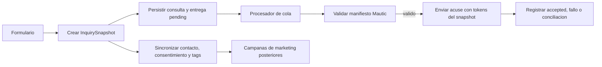

# Consultas: acuse transaccional con snapshot inmutable

## Estado y alcance

Diseno aprobado para planificacion. Este documento no autoriza cambios de
codigo, mutaciones de configuracion en Mautic, envios de correo ni retiro de
componentes legacy. La implementacion comenzara solo despues de aprobar el
plan derivado.

Sustituye, para el acuse inmediato de consultas, el modelo descripto en
`2026-09-30-wordpress-mautic-campaign-architecture-design.md`: una campana no
sera responsable del acuse. Esa campana y cualquier automatizacion posterior
permanecen reservadas para marketing y seguimiento.

El alcance incluye consultas de oferta y de seminario, su persistencia, el
acuse inmediato, la sincronizacion de contacto, el contrato Mautic y las
pruebas que aseguran la separacion. No incluye una campana de seguimiento ni
una migracion masiva de contactos o datos historicos.

## Problema y objetivo

Una consulta contiene datos que deben conservarse tal como existian al
momento de enviarla. Si una misma persona consulta otra oferta, los campos del
contacto en Mautic pueden cambiar antes de que una campana procese la primera
consulta. Por ello, los campos de contacto no son una fuente valida para
personalizar un acuse transaccional.

El objetivo es que WordPress conserve una consulta historica completa y
ejecute una entrega transaccional idempotente basada en su snapshot inmutable.
Mautic continuara siendo el sistema de entrega y de automatizacion comercial,
pero no la fuente de verdad de una consulta. El texto libre de la persona no
sale de WordPress ni se escribe en logs operativos.

## Limites de responsabilidad

| Componente | Responsabilidad |
| --- | --- |
| Formulario y servicios de consulta | Validar la entrada y pedir la creacion atomica de la consulta. |
| `InquirySnapshot` | Representar los datos inmutables que se usaran para persistencia, acuse y contexto academico. |
| Repositorio WordPress | Guardar consulta, snapshot y entrega, y ofrecer transiciones de estado seguras. |
| Cola transaccional | Seleccionar entregas pendientes, aplicar reintentos acotados e impedir duplicados. |
| Adaptador Mautic | Validar contrato, sincronizar datos de contacto permitidos y enviar el acuse con tokens por entrega. |
| Campanas Mautic | Marketing y seguimiento posterior; nunca el acuse inmediato. |
| Consola WordPress | Mostrar configuracion, validacion, estados y errores redactados; no secretos ni datos personales. |

## Modelo de datos y contratos

### Snapshot canonico

Se incorporara un DTO base `InquirySnapshot` como unica fuente de nombres para
una consulta. Se construye antes de persistir y se serializa sin reinterpretar
datos en cada consumidor. Expone identidad, destinatario, procedencia y los
datos academicos compartidos. `OfferInquirySnapshot` y
`SeminarInquirySnapshot` agregan solamente los atributos propios de cada tipo;
no se usa un objeto unico con campos opcionales ambiguos. Todo snapshot debe
incluir:

- identidad de consulta, tipo, fecha UTC y origen;
- datos del destinatario necesarios para la entrega;
- oferta, cohorte, articulo, modalidad, fecha de inicio y precision;
- enlaces publicos de oferta y preinscripcion;
- informacion academica que actualmente se deriva en el contexto;
- etiquetas canonicas de interes y procedencia;
- una version de esquema para que los snapshots nuevos puedan evolucionar sin
  reinterpretar los historicos.

Los nombres internos seran uniformes. En particular, fecha de inicio y
modalidad se exponen una sola vez en el DTO y el builder no aceptara las
variantes incompatibles actuales (`startValue` frente a `fechaInicio`,
`modalityLabel` frente a `modalidad`). El snapshot conserva el valor y su
precision para decidir si un campo de fecha se puede emitir como `YYYY-MM-DD`.

El mensaje libre de la consulta se conserva en el registro WordPress asociado,
fuera del payload de Mautic y fuera de los eventos de diagnostico. El campo
Mautic legado `flacso_consulta_texto` no se borra automaticamente, pero deja de
recibir valores del flujo nuevo.

La creacion de la consulta, su snapshot y su entrega debe ocurrir en una unica
transaccion de base de datos. Un fallo en cualquiera de las tres escrituras
revierte las otras; no puede existir una consulta sin snapshot ni snapshot sin
entrega inicial.

### Entrega transaccional

Cada consulta crea exactamente una entrega de tipo `acknowledgement`. La
entrega guarda el snapshot serializado, el payload transaccional exacto, la
identidad de la plantilla Mautic y su revision aprobada. Esos valores no se
reconstruyen al reintentar ni se reemplazan cuando cambia la oferta o la
plantilla. Sus estados son:

| Estado | Significado |
| --- | --- |
| `pending` | Lista para procesar. |
| `processing` | Reservada por un trabajador durante un tiempo limitado. |
| `accepted` | Mautic acepto la solicitud; conserva respuesta, identificadores y fecha. No prueba entrega. |
| `acceptance_unknown` | La solicitud pudo haber llegado a Mautic, pero WordPress no puede probar si fue aceptada. Requiere conciliacion antes de cualquier nuevo envio. |
| `retryable_failed` | Fallo recuperable, con contador y proxima fecha de intento. |
| `failed` | Fallo final que requiere diagnostico o reintento manual. |
| `blocked` | La configuracion o el contrato no superaron una puerta de activacion. |

La clave de idempotencia es `(consulta_id, acknowledgement)`. Una transicion a
`processing` debe ser atomica; una misma entrega no puede ser enviada por dos
trabajadores. Cada intento recibe un identificador unico y conserva hora de
inicio, solicitud, respuesta o error redactado. Si vence una reserva despues de
iniciar la solicitud, la entrega pasa a `acceptance_unknown`, no vuelve a
`pending` y no se reenvia automaticamente. La conciliacion debe determinar
si Mautic acepto el intento o requerir una decision manual antes de crear uno
nuevo. Solo un fallo comprobado antes de iniciar la solicitud puede volver a
`retryable_failed`. La respuesta aceptada por la API de Mautic prueba
aceptacion del envio, no entrega final, apertura ni lectura.

No se introduce un fallback a Mailjet ni se emplea `wp_mail` para este flujo.
Ante una falla de Mautic, la entrega conserva su estado para reintento y se
notifica mediante el mecanismo de alertas del plugin. Telegram es el canal
preferido cuando este configurado; en ausencia de esa configuracion se usa el
correo administrativo de WordPress. El formulario responde sin depender del
resultado sincrono de Mautic, siempre que la consulta y su entrega se hayan
persistido.

### Contacto y etiquetas

La sincronizacion de contacto es una operacion independiente de la entrega.
Solo actualiza perfil permitido, consentimiento, procedencia y etiquetas
acumulativas. No escribe en el contacto valores que representen una consulta
particular: oferta, cohorte, fecha, modalidad, enlaces ni identificador de
consulta dejan de ser requisitos para campanas.

Una unica fabrica de etiquetas recibe `InquirySnapshot` y devuelve las
etiquetas normalizadas. El contrato inicial es:

```
interes-{codigo}
{codigo}-c{numero}
origen-web-consultas
```

La segunda etiqueta solo existe con cohorte valida. Las etiquetas se agregan
sin eliminar intereses anteriores. Las variantes heredadas no se vuelven a
generar; se preservan mientras existan en contactos historicos.

El contacto solo puede incorporarse a una campana comercial si existe
consentimiento explicito para marketing, conservando fecha UTC, origen y la
version del texto aceptado. La ausencia de ese consentimiento no impide el
acuse transaccional, pero bloquea toda incorporacion a campanas comerciales.

## Integracion Mautic y puerta de tokens

El acuse se enviara mediante una plantilla transaccional de Mautic y el
endpoint de envio directo a contacto ya encapsulado por
`FLACSO_Mautic_Client`. La plantilla debe resolver datos desde los tokens de la
entrega, no desde `contactfield=flacso_*` ni desde campos mutables del
contacto.

Antes de implementar o activar el procesador, se realizara una prueba aislada
contra Mautic con un contacto interno controlado y una plantilla de prueba. La
prueba debe demostrar, con dos snapshots distintos enviados al mismo contacto,
que asunto, oferta, fecha, modalidad y enlaces corresponden al token de cada
envio y no al ultimo valor guardado en el contacto. La prueba no empleara
mensajes libres ni datos de terceros.

La prueba es una puerta obligatoria:

- **Aprobada:** se registra la sintaxis de token soportada, el endpoint, el
  resultado de render y la evidencia de entrega en la documentacion operativa;
  entonces puede planificarse el adaptador definitivo.
- **Rechazada:** no se activa ni implementa el acuse productivo sobre una
  suposicion. Se vuelve a disenar la via transaccional con Mautic antes de
  continuar; no se usa una campana como sustituto silencioso.

La configuracion separa ID de plantilla transaccional, activacion de cola y
configuracion de campana de marketing. Ningun ID de plantilla aparece como
detalle de negocio en el formulario ni en la consola general.

## Ejecutor de cola

El acuse no depende de WP-Cron ni de visitas publicas. Un cron del servidor se
ejecuta cada minuto e invoca un comando WordPress dedicado para procesar un lote
acotado de entregas. El comando toma un bloqueo global con vencimiento, evita
dos ejecuciones concurrentes y reclama entregas mediante una transicion atomica
a `processing`. El bloqueo solo impide trabajo paralelo; no habilita reenviar
una reserva vencida cuyo resultado sea desconocido.

La frecuencia de un minuto es el objetivo de inmediatez inicial. El tamano de
lote, la duracion maxima de bloqueo y la politica de reintentos se configuran
como valores operativos conservadores y se registran en la documentacion de
despliegue. El comando puede invocarse manualmente en modo diagnostico, pero
requiere una accion explicita para procesar una entrega marcada
`acceptance_unknown`.

## Manifiesto y validacion de contrato

El contrato deja de ser solamente Markdown. Un manifiesto PHP versionado
describe, como minimo, la version, aliases de perfil permitidos, opciones de
select, tipo de cada campo requerido, tags, plantilla transaccional y campana
de marketing opcional. La documentacion se genera o se contrasta contra ese
manifiesto; no puede convertirse en una tercera fuente de verdad.

Un validador de solo lectura consulta Mautic y produce un resultado estructurado
por requisito: presente, alias, tipo, opciones, publicacion de plantilla y
configuracion de campana. La cola queda `blocked` si falta un requisito del
acuse. Los errores muestran identificadores tecnicos redactados, nunca claves,
tokens, correo completo ni payloads con datos personales.

El manifiesto no requiere el campo `flacso_consulta_texto` y no autoriza enviar
campos volatiles de la consulta al contacto. Los campos existentes se preservan
en Mautic hasta que una eliminacion sea aprobada por separado.

## Flujo operativo



La sincronizacion de contacto no bloquea la persistencia de la consulta. Su
estado se diagnostica de forma separada del estado de entrega. La campana de
marketing no participa en el camino de acuse y puede estar desactivada sin
interrumpir una entrega transaccional ya validada.

## Migracion reversible

1. Agregar DTO, persistencia y pruebas sin activar procesadores ni modificar
   datos existentes.
2. Ejecutar y documentar la prueba aislada de tokens en un contacto interno.
3. Incorporar manifiesto, validador, adaptador, ejecutor de servidor y cola con
   la activacion apagada.
4. Ejecutar pruebas integradas controladas, primero sin destinatarios externos
   y luego con la aprobacion operativa correspondiente.
5. Activar la cola transaccional; mantener la campana de marketing separada y
   apagada hasta su propia aprobacion.
6. Tras evidencia estable, incluido el procedimiento de conciliacion, eliminar el bloque inalcanzable, la configuracion
   y los caminos de Mailjet relacionados con consultas, junto con las pruebas
   que hoy ocultan escenarios legacy.

El rollback en las fases iniciales es desactivar la cola. No elimina consultas,
snapshots, entregas, campos Mautic, campanas ni contactos. Los datos ya
persistidos siguen disponibles para diagnostico y reintento manual.

## Errores, alertas y privacidad

Los fallos de persistencia se devuelven al formulario porque impiden crear una
consulta. Los fallos posteriores de sincronizacion, contrato o entrega no
eliminan la consulta: actualizan el estado de la operacion, programan o
bloquean reintentos segun su clase y activan la alerta configurada en el
plugin. Telegram es el canal preferido cuando este configurado; en ausencia de
esa configuracion se usa el correo administrativo de WordPress.

Los eventos operativos contienen ID de consulta, ID de entrega, operacion,
estado, codigo HTTP y error clasificado. No incluyen el texto de la consulta,
email completo, tokens, claves ni cuerpo de la solicitud.

## Pruebas y criterios de aceptacion

La implementacion debe agregar pruebas unitarias, de integracion de adaptador y
de persistencia que cubran al menos:

- construccion y serializacion estable de `InquirySnapshot`;
- propagacion de fecha, precision y modalidad desde contexto a snapshot y
  payload transaccional;
- unica definicion de etiquetas y ausencia de variantes contradictorias;
- dos consultas consecutivas del mismo email con acuses que mantienen sus
  datos respectivos;
- transaccion atomica de consulta, snapshot y entrega;
- identidad de intento, payload exacto y plantilla/revision inmutables;
- idempotencia y paso de una reserva vencida a `acceptance_unknown`, sin
  reenvio automatico;
- bloqueo de ejecuciones concurrentes y ejecucion desde cron del servidor;
- aliases ausentes, tipos incompatibles y opciones select invalidas en el
  manifiesto;
- bloqueo de cola ante contrato invalido;
- exclusion de `flacso_consulta_texto` de todo payload y log Mautic;
- acuse permitido sin consentimiento comercial e imposibilidad de ingresar a
  campanas sin fecha, origen y version del consentimiento;
- clasificacion de errores recuperables y finales, con alerta sin datos
  sensibles;
- prueba aislada real de tokens antes de habilitar el envio productivo.

La activacion requiere, por separado, pruebas locales aprobadas, CI verde,
despliegue del SHA exacto, validacion de configuracion en produccion y evidencia
de la prueba controlada. Ninguna de esas condiciones se infiere de las otras.

## Fuera de alcance

- Seguimientos temporizados o condicionales en Mautic.
- Borrado de campos o contactos historicos.
- Migracion masiva de listas, bajas o consentimiento previo.
- Envio del texto libre de consulta a Mautic.
- Fallback automatico a Mailjet o correo nativo de WordPress.
